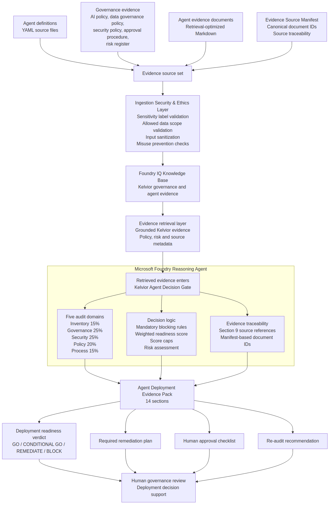

# Kelvior Agent Decision Gate

**Microsoft Foundry reasoning agent for enterprise AI-agent deployment readiness assessment.**

Kelvior Agent Decision Gate evaluates whether AI agents are ready for enterprise deployment inside the fictional Kelvior Systems environment.

The project uses Microsoft Foundry, Foundry IQ and governed Kelvior evidence to produce structured deployment-readiness decisions:

- `GO`
- `CONDITIONAL GO`
- `REMEDIATE`
- `BLOCK`

The output is a 14-section **Agent Deployment Evidence Pack** with audit-domain scores, mandatory blocking-rule evaluation, evidence references, risk assessment, remediation actions, human approval checklist and re-audit recommendation.

---

## Problem

Enterprise AI agents can move faster than governance teams can review them.

Common failure points include:

- unclear ownership
- missing data governance review
- missing security review
- unclear approval status
- weak audit logging
- no human approval gate
- uncontrolled MCP or system access
- no escalation path
- weak misuse prevention
- no evidence trail for deployment decisions

Kelvior Agent Decision Gate acts as a reasoning-based governance gate before an AI agent is approved, expanded or moved toward production.

It does not deploy agents automatically.

It supports human governance review with structured, evidence-grounded assessment output.

---

## Key capabilities

- Evidence-grounded deployment readiness assessment
- Mandatory blocking-rule evaluation
- Weighted audit-domain scoring with score caps
- Foundry IQ source traceability
- Section 9 evidence reference validation
- Risk classification: triggered, mitigated and not applicable
- Ethics and misuse-prevention checks
- Human approval and re-audit decision support

---

## What the agent does

The Decision Gate assesses an AI agent across five audit domains:

| Domain     | Weight | Purpose                                                                                                                |
| ---------- | -----: | ---------------------------------------------------------------------------------------------------------------------- |
| Inventory  |    15% | Checks whether the agent identity, owners, process, systems, connectors, actions and deployment scope are defined.     |
| Governance |    25% | Checks ownership, approval status, human approval gates, monitoring, audit logging, review cadence and accountability. |
| Security   |    25% | Checks security review, access control, least privilege, logging, incident response and controlled actions.            |
| Policy     |    20% | Checks alignment with AI policy, data governance policy, security policy and approval procedure.                       |
| Process    |    15% | Checks operational boundaries, exception handling, escalation paths and human-in-the-loop controls.                   |

The agent applies:

- mandatory blocking rules
- weighted readiness scoring
- score caps for limited or conditional deployments
- risk assessment
- source-grounded evidence references
- ethics and misuse-prevention checks
- human approval review logic

---

## Validated assessment results

The Decision Gate was tested against five Kelvior AI-agent scenarios.

| Agent                     | Verdict          | Why it matters                                                                                                                       | Sample output                                                        |
| ------------------------- | ---------------- | ------------------------------------------------------------------------------------------------------------------------------------ | -------------------------------------------------------------------- |
| Finance Invoice Assistant | `BLOCK`          | Shows that the gate blocks financial automation when mandatory governance, security, data, approval or process controls are missing. | [View output](outputs/sample_evidence_pack_finance.md)               |
| IT Ticket Triage          | `GO`             | Shows that the gate can approve a controlled, read-only, recommendation-only IT agent when required evidence is complete.            | [View output](outputs/sample_evidence_pack_it_ticket_triage.md)      |
| Learning Policy Coach     | `CONDITIONAL GO` | Shows conditional approval for an internal learning-support agent with controlled rollout requirements.                              | [View output](outputs/sample_evidence_pack_learning_policy_coach.md) |
| Sales Proposal Agent      | `CONDITIONAL GO` | Shows commercial misuse prevention for proposal drafting, discounts, binding offers and human approval requirements.                 | [View output](outputs/sample_evidence_pack_sales_proposal.md)        |
| HR Onboarding Helper      | `REMEDIATE`      | Shows remediation behavior for a high-risk HR agent in pre-production with restricted HR data and missing foundational controls.                                      | [View output](outputs/sample_evidence_pack_hr_onboarding_helper.md)  |

---

## Architecture

The system is designed as an evidence-grounded reasoning gate.

High-level flow:

```text
Agent definitions + governance evidence
→ Ingestion Security and Ethics Layer
→ Foundry IQ Knowledge Base
→ Evidence retrieval layer
→ Microsoft Foundry Reasoning Agent
→ Agent Deployment Evidence Pack
→ Human governance review / deployment decision support
```



For the editable Mermaid source, see [Architecture Overview](docs/architecture_overview.md).

---

## Architecture principles

### 1. Evidence before verdict

The agent must retrieve and use Kelvior evidence before scoring or assigning a verdict.

Evidence includes:

- AI policy
- data governance policy
- security policy
- agent approval procedure
- enterprise risk register excerpt
- agent-specific evidence documents
- Evidence Source Manifest

### 2. One reasoning agent, not multiple hidden services

The audit domains, blocking logic, score caps, risk assessment and traceability checks are internal reasoning controls of the Microsoft Foundry reasoning agent.

They are not separate external audit services.

### 3. Human decision support

The Decision Gate does not deploy agents.

It produces an evidence pack that supports human governance review, remediation planning and deployment decision-making.

### 4. Source traceability

The agent uses a retrieval-visible Evidence Source Manifest to map source documents to canonical document IDs, titles and evidence roles.

This reduces the risk of invented document IDs or unclear source attribution.

---

## Foundry IQ source design

The Foundry IQ source set contains multiple synthetic Kelvior enterprise evidence sources.

The project uses Foundry IQ to ground the reasoning agent in multiple synthetic Kelvior enterprise evidence sources, including enterprise context, AI policy, data governance policy, security policy, approval procedure, enterprise risk register and agent-specific evidence documents.

For the MVP, these enterprise sources are represented as retrieval-optimized Markdown documents. In a production implementation, the same pattern could connect to governed enterprise repositories such as SharePoint, policy libraries, risk systems, HR systems, CRM systems or indexed document stores with scoped retrieval permissions.

The YAML files are source-controlled agent definitions. Foundry IQ uses retrieval-optimized Markdown evidence documents derived from those YAML definitions.

The source set includes:

```text
00_evidence_source_manifest.md
01_kelvior_enterprise_context_excerpt.md
02_kelvior_ai_policy.md
03_kelvior_data_governance_policy.md
04_kelvior_security_policy.md
05_agent_approval_procedure.md
06_enterprise_risk_register_excerpt.md
07_finance_invoice_assistant_evidence.md
08_it_ticket_triage_evidence.md
09_learning_policy_coach_evidence.md
10_sales_proposal_agent_evidence.md
11_hr_onboarding_helper_evidence.md
```

The MVP uses retrieval-friendly Markdown evidence documents with repeated evidence-source markers near key policy sections to preserve source traceability after chunking.

In a production implementation, these markers would be replaced or supplemented by chunk-level metadata fields in the Azure AI Search / Foundry IQ ingestion pipeline.

The MVP also includes a retrieval-visible Evidence Source Manifest that maps Foundry IQ source documents to canonical document IDs, titles and evidence roles. This provides audit-friendly source identity for the hackathon implementation.

In production, this mapping would be enforced through chunk-level metadata fields in the Azure AI Search / Foundry IQ ingestion pipeline.

---

## Ingestion Security and Ethics Layer

The MVP models a minimal **Ingestion Security and Ethics Layer** before retrieval and reasoning.

This layer is designed to validate whether incoming agent definitions and evidence are appropriate for assessment before they are grounded through Foundry IQ.

The layer addresses four pre-retrieval concerns:

- sensitivity label validation
- allowed data scope validation
- input sanitization for prompt-injection or instruction-override attempts
- ethics and misuse-prevention checks

The Ingestion Security and Ethics Layer is represented as an MVP architecture layer and lightweight validation concept.

Production enforcement would require Microsoft Purview sensitivity labels, Azure RBAC, managed identities, scoped retrieval permissions and policy-driven access control.

---

## Ethics and misuse prevention

The Decision Gate evaluates whether an assessed agent is used only within its declared:

- intended purpose
- approved business process
- approved deployment scope
- approved data scope
- approved user groups
- approved systems
- approved MCP connectors
- allowed actions

This prevents agents from being approved for uses outside their intended design, such as:

- unauthorized financial actions
- HR profiling
- binding contract commitments
- compensation decisions
- surveillance
- disciplinary decisions
- access-control decisions
- customer-impacting decisions without explicit approval and human oversight

Ethics and misuse prevention are assessed as part of Governance, Policy and Process.

---

## Guardrails

The MVP includes these guardrails:

| Guardrail                      | Purpose                                                                 |
| ------------------------------ | ----------------------------------------------------------------------- |
| Foundry IQ grounding           | Keeps assessments tied to Kelvior evidence.                             |
| Evidence Source Manifest       | Preserves canonical document identity and source traceability.          |
| Mandatory blocking rules       | Prevents GO or CONDITIONAL GO when critical controls are missing.       |
| Risk ID rules                  | Prevents invented risk IDs.                                             |
| Section 9 evidence references  | Forces source-level evidence traceability.                              |
| Section 10 risk classification | Separates triggered, mitigated and not-applicable risks.                |
| Score caps                     | Prevents numeric overstatement for limited or conditional deployments.  |
| Human approval checks          | Keeps high-impact decisions under human review.                         |
| Ethics and misuse checks       | Detects use outside approved scope, process, data or action boundaries. |

---

## Output format

Each full readiness assessment produces exactly 14 sections:

1. Agent summary
2. Business context
3. Systems and MCP connectors
4. Data classification
5. Audit domain scores
6. Weighted readiness score
7. Mandatory blocking rule evaluation
8. Findings by domain
9. Evidence references
10. Risk assessment
11. Deployment verdict
12. Required remediation plan
13. Human approval checklist
14. Re-audit recommendation

The Evidence Pack is designed to be reviewable by governance, security, data, risk and business stakeholders.

---

## Repository structure

```text
agent_definitions/
  agent_finance_invoice.yaml
  agent_hr_onboarding.yaml
  agent_it_ticket_triage.yaml
  agent_learning_coach.yaml
  agent_sales_proposal.yaml

agent_instructions/
  kelvior_agent_decision_gate_instruction.md

foundry_iq_sources/
  00_evidence_source_manifest.md
  01_kelvior_enterprise_context_excerpt.md
  02_kelvior_ai_policy.md
  03_kelvior_data_governance_policy.md
  04_kelvior_security_policy.md
  05_agent_approval_procedure.md
  06_enterprise_risk_register_excerpt.md
  07_finance_invoice_assistant_evidence.md
  08_it_ticket_triage_evidence.md
  09_learning_policy_coach_evidence.md
  10_sales_proposal_agent_evidence.md
  11_hr_onboarding_helper_evidence.md

outputs/
  sample_evidence_pack_finance.md
  sample_evidence_pack_it_ticket_triage.md
  sample_evidence_pack_learning_policy_coach.md
  sample_evidence_pack_sales_proposal.md
  sample_evidence_pack_hr_onboarding_helper.md

docs/
  architecture_overview.md
  assets/
    kelvior_architecture.png

README.md
LICENSE
.gitignore
```

---

## How to run

This project requires a configured Microsoft Foundry project with Foundry IQ connected.

1. Upload the Foundry IQ source set from `foundry_iq_sources/` to your Foundry IQ knowledge base.

2. Configure the Microsoft Foundry reasoning agent using the agent instruction from:

   ```text
   agent_instructions/kelvior_agent_decision_gate_instruction.md
   ```

3. Make sure the Foundry IQ knowledge base is connected to the reasoning agent.

4. Run an assessment using a prompt such as:

   ```text
   Perform a full deployment readiness assessment for the Finance Invoice Assistant using the connected Kelvior Foundry IQ knowledge base.
   ```

5. Review the generated Agent Deployment Evidence Pack.

Sample outputs are available in `outputs/` for reference without running the agent.

---

## Technologies used

- Microsoft Foundry
- Foundry IQ
- Azure AI Search-backed retrieval tool/resource provisioned through Foundry IQ
- Multiple synthetic Kelvior enterprise evidence sources
- YAML agent definitions
- Retrieval-optimized Markdown evidence documents
- Evidence Source Manifest
- Mermaid architecture diagrams
- GitHub

---

## Demo cases

The demo focuses on two cases to show contrast without overloading the walkthrough.

### Primary demo: Finance Invoice Assistant → BLOCK

This case shows why a governance gate matters.

The Finance Invoice Assistant is blocked because financial automation requires strong governance, approval, audit logging, data review, security review, segregation-of-duties validation and human approval controls.

### Contrast demo: IT Ticket Triage → GO

This case shows that the Decision Gate does not block everything.

The IT Ticket Triage agent can receive a GO verdict because it is read-only, recommendation-only, approved, logged, monitored and controlled through human review.

### Additional validated outputs

Three additional sample assessments are included in `outputs/`:

- Learning Policy Coach → `CONDITIONAL GO`
- Sales Proposal Agent → `CONDITIONAL GO`
- HR Onboarding Helper → `REMEDIATE`

---

## MVP boundary and production path

This MVP demonstrates the reasoning, grounding, traceability and governance pattern for enterprise AI-agent deployment readiness assessment.

It is not a full production enforcement system.

The current implementation focuses on:

- evidence-grounded reasoning through Foundry IQ
- structured deployment-readiness assessment
- mandatory blocking rules
- weighted readiness scoring and score caps
- source traceability through the Evidence Source Manifest
- ethics and misuse-prevention checks
- human governance review and deployment decision support

The MVP does not implement:

- live production enforcement
- real-time Microsoft Purview policy enforcement
- production-grade Azure RBAC enforcement
- managed identity access enforcement
- production metadata-filtered retrieval permissions
- live MCP action enforcement
- automated approval workflow execution
- enterprise audit trail storage
- live CRM, ERP, HR or ITSM system actions

A production version would add:

- Microsoft Purview sensitivity labels
- Azure RBAC
- managed identities
- scoped retrieval permissions
- Azure AI Search / Foundry IQ metadata filters
- policy-as-code validation
- approval workflow integration
- audit trail and run history
- stronger ingestion validation
- automated evidence freshness checks
- continuous control monitoring

The MVP proves the decision pattern first: governed evidence enters the retrieval layer, the Microsoft Foundry reasoning agent evaluates deployment readiness, and the output supports human governance review.

---

## Synthetic enterprise environment

Kelvior Systems is a fictional enterprise simulation environment created for educational, architectural and portfolio purposes.

All data, employees, customers, vendors, processes, policies, systems and documents are synthetic.

No real customer, employee, vendor or confidential business data is used.

---

## Project status

Submission-ready MVP status:

- Microsoft Foundry reasoning agent configured
- Foundry IQ knowledge base connected
- Multiple Kelvior enterprise evidence sources prepared
- Five sample assessments generated
- Architecture diagram created
- Evidence Pack format validated
- Repository documentation prepared
- Demo video prepared for submission

---

## License and disclaimer

This repository was created for a synthetic enterprise simulation, hackathon submission and portfolio demonstration.

Kelvior Systems is a fictional enterprise environment. All business data, policies, systems, employees, customers, vendors and evidence documents used in this project are synthetic. No real confidential, customer, employee or vendor data is included.

This project is released under the MIT License.

Microsoft Foundry, Foundry IQ, Azure and related Microsoft product names are trademarks or product names of Microsoft. This project is an independent synthetic enterprise simulation and is not affiliated with, endorsed by, or sponsored by Microsoft.
