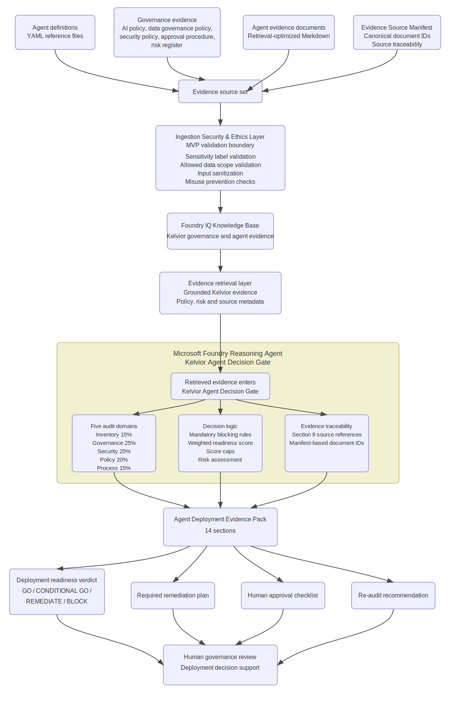

# Kelvior Agent Decision Gate

**A Microsoft Foundry reasoning-agent MVP for evidence-based AI-agent deployment decisions.**

I built Kelvior Agent Decision Gate because I do not think every AI agent should automatically go live once it works in a demo.

In real organizations, the harder question is not only:

> Can this agent perform the task?

The harder question is:

> Should this agent be allowed to run in this process, with this data, under these controls?

This project explores that question through a Microsoft Foundry-based reasoning agent. The agent evaluates whether an enterprise AI agent is ready for deployment by using synthetic Kelvior governance, security, policy, process and risk evidence.

The output is not a chatbot answer. It is a structured **Agent Deployment Evidence Pack** that connects evidence, risks, gaps, remediation actions and a deployment verdict.

Valid verdicts are:

- `GO`
- `CONDITIONAL GO`
- `REMEDIATE`
- `BLOCK`

---

## Project status

This project was originally built and submitted for the **Microsoft Agents League Hackathon 2026**, Reasoning Agents track.

The hackathon phase is complete.

The project is now maintained as a portfolio artifact to show how I think about:

- Microsoft Foundry reasoning agents
- retrieval-grounded assessment
- AI-agent governance
- auditability
- risk-based deployment decisions
- evidence traceability
- honest MVP boundaries

This is a working MVP and architecture demonstration.

It is not a production governance platform, a Microsoft-certified solution or a real enterprise deployment.

---

## The problem

AI agents can move faster than the controls around them.

That creates a practical governance problem. An agent may look useful, but still be unsafe or incomplete because it has:

- unclear ownership
- missing approval status
- weak audit logging
- no human approval gate
- incomplete data governance review
- incomplete security review
- uncontrolled connector or MCP access
- no escalation path
- weak misuse prevention
- no evidence trail for deployment decisions

Kelvior Agent Decision Gate is designed as a pre-deployment reasoning gate.

It does not deploy agents automatically.

It helps a human reviewer understand whether an AI agent is ready, conditionally acceptable, in need of remediation or blocked from deployment.

---

## What the project does

The Decision Gate assesses an AI agent across five audit domains:

| Domain     | Weight | What it checks                                                                                                       |
| ---------- | -----: | -------------------------------------------------------------------------------------------------------------------- |
| Inventory  |    15% | Whether the agent identity, owner, scope, systems, connectors, actions and deployment context are defined.           |
| Governance |    25% | Whether ownership, approval status, monitoring, audit logging, review cadence and human accountability are in place. |
| Security   |    25% | Whether access control, least privilege, logging, incident response and controlled actions are sufficiently covered. |
| Policy     |    20% | Whether the agent aligns with AI policy, data governance policy, security policy and approval procedure evidence.    |
| Process    |    15% | Whether operational boundaries, exception handling, escalation paths and human-in-the-loop controls are defined.     |

The agent then applies:

- mandatory blocking rules
- weighted readiness scoring
- score caps for conditional or limited deployments
- risk assessment
- source-grounded evidence references
- ethics and misuse-prevention checks
- human approval review logic

The important part is the chain:

```text
evidence → finding → risk → remediation → verdict
```

A verdict should never stand on its own.

---

## Validated assessment results

The Decision Gate was tested against five synthetic Kelvior AI-agent scenarios.

| Agent                     | Verdict          | What the case shows                                                                                                                                                                                                                          | Sample output                                                        |
| ------------------------- | ---------------- | -------------------------------------------------------------------------------------------------------------------------------------------------------------------------------------------------------------------------------------------- | -------------------------------------------------------------------- |
| Finance Invoice Assistant | `BLOCK`          | A finance automation agent should not go live when mandatory governance, security, data, approval or process controls are missing.                                                                                                           | [View output](outputs/sample_evidence_pack_finance.md)               |
| IT Ticket Triage          | `GO`             | A read-only, recommendation-only IT agent can pass when ownership, approval, logging, monitoring and human review are in place.                                                                                                              | [View output](outputs/sample_evidence_pack_it_ticket_triage.md)      |
| Learning Policy Coach     | `CONDITIONAL GO` | A controlled Academy pilot can be acceptable when foundational controls exist, but broader rollout still depends on clearer exception ownership, SLA definition and stricter HR knowledge-source retrieval filtering.                        | [View output](outputs/sample_evidence_pack_learning_policy_coach.md) |
| Sales Proposal Agent      | `CONDITIONAL GO` | A commercial drafting agent needs clear controls around discounts, binding offers, customer impact and human approval.                                                                                                                       | [View output](outputs/sample_evidence_pack_sales_proposal.md)        |
| HR Onboarding Helper      | `REMEDIATE`      | A planned pre-production HR agent can be assessed and remediated, but restricted HR data requires stronger privacy, governance, security, audit, monitoring and incident-response controls before production or broader employee-facing use. | [View output](outputs/sample_evidence_pack_hr_onboarding_helper.md)  |

These examples are included to show that the gate does not simply block everything. It makes different decisions based on evidence, scope and risk.

---

## About the sample outputs

The files in `outputs/` are sample Evidence Packs from MVP testing.

They show the reasoning pattern, evidence structure and verdict behavior used in the project. They are not compliance certifications, production deployment approvals or guaranteed outputs for every future run.

Because the assessments are generated by a reasoning agent over retrieved evidence, minor wording variations can occur between runs. In real organizational use, generated Evidence Packs should be reviewed against source evidence, validated through evaluation runs and governed by organization-specific approval rules.

---

## Architecture

The system is designed as an evidence-grounded reasoning gate.

```text
Agent definitions + Kelvior evidence
→ Ingestion Security and Ethics Layer
→ Foundry IQ Knowledge Base
→ Retrieval layer
→ Microsoft Foundry reasoning agent
→ Agent Deployment Evidence Pack
→ Human governance review
```



For the editable Mermaid source, see:

[docs/architecture_overview.md](docs/architecture_overview.md)

---

## Core architecture choices

The architecture rests on four choices: evidence must ground every verdict, one Microsoft Foundry reasoning agent implements the audit logic rather than separate production services, Foundry IQ grounds the agent in the synthetic Kelvior evidence set, and the Decision Gate supports human decision-makers rather than replacing them.

The full rationale for each choice is documented in [docs/architecture_overview.md](docs/architecture_overview.md#architecture-flow).

---

## Foundry IQ source design

The Foundry IQ source set lives in:

```text
foundry_iq_sources/
```

It contains synthetic Kelvior evidence documents:

```text
00_evidence_source_manifest.md
01_kelvior_enterprise_context_excerpt.md
02_kelvior_ai_policy.md
03_kelvior_data_governance_policy.md
04_kelvior_security_policy.md
05_agent_approval_procedure.md
06_enterprise_risk_register_excerpt.md
07_finance_invoice_assistant_evidence.md
08_it_ticket_triage_evidence.md
09_learning_policy_coach_evidence.md
10_sales_proposal_agent_evidence.md
11_hr_onboarding_helper_evidence.md
```

The YAML files in `agent_definitions/` are source-controlled agent definitions.

The Markdown files in `foundry_iq_sources/` are the retrieval-friendly evidence documents used by Foundry IQ.

For the MVP, repeated evidence-source markers are placed near important sections to preserve source traceability after chunking.

In production, those markers should be replaced or strengthened with chunk-level metadata in the Azure AI Search / Foundry IQ ingestion pipeline.

---

## Evidence Source Manifest

The Evidence Source Manifest maps source documents to canonical document IDs, titles and evidence roles, which reduces the risk of unclear source attribution or invented document references.

See [docs/architecture_overview.md](docs/architecture_overview.md#7-evidence-traceability) and [foundry_iq_sources/README.md](foundry_iq_sources/README.md#evidence-traceability) for the full traceability model.

---

## Ingestion Security and Ethics Layer

The architecture includes a lightweight **Ingestion Security and Ethics Layer** before retrieval and reasoning. In this MVP, it is a design concept covering sensitivity label validation, allowed data scope validation, prompt-injection detection and misuse-prevention checks — not full production enforcement.

The full layer design and required production controls are documented in [docs/architecture_overview.md](docs/architecture_overview.md#2-ingestion-security-and-ethics-layer).

---

## Ethics and misuse prevention

The Decision Gate checks whether an assessed agent stays within its declared:

- purpose
- business process
- deployment scope
- data scope
- user groups
- systems
- MCP connectors
- allowed actions

This is important because many AI-agent risks do not come from the model alone.

They come from using an agent outside the context it was approved for.

Examples of misuse that should be blocked or escalated include:

- unauthorized financial actions
- HR profiling
- binding contract commitments
- compensation decisions
- surveillance
- disciplinary decisions
- access-control decisions
- customer-impacting decisions without explicit approval and human oversight

Ethics and misuse prevention are assessed through the Governance, Policy and Process domains.

---

## Guardrails

The MVP includes these guardrails:

| Guardrail                      | Purpose                                                                 |
| ------------------------------ | ----------------------------------------------------------------------- |
| Foundry IQ grounding           | Keeps assessments tied to Kelvior evidence.                             |
| Evidence Source Manifest       | Preserves canonical document identity and source traceability.          |
| Mandatory blocking rules       | Prevents `GO` or `CONDITIONAL GO` when critical controls are missing.   |
| Risk ID rules                  | Prevents invented risk IDs.                                             |
| Section 9 evidence references  | Forces source-level evidence traceability.                              |
| Section 10 risk classification | Separates triggered, mitigated and not-applicable risks.                |
| Score caps                     | Prevents numeric overstatement for limited or conditional deployments.  |
| Human approval checks          | Keeps high-impact decisions under human review.                         |
| Ethics and misuse checks       | Detects use outside approved scope, process, data or action boundaries. |

---

## Evidence Pack output

Each full readiness assessment produces a 14-section **Agent Deployment Evidence Pack**:

1. Agent summary
2. Business context
3. Systems and MCP connectors
4. Data classification
5. Audit domain scores
6. Weighted readiness score
7. Mandatory blocking rule evaluation
8. Findings by domain
9. Evidence references
10. Risk assessment
11. Deployment verdict
12. Required remediation plan
13. Human approval checklist
14. Re-audit recommendation

The Evidence Pack is meant to be readable by governance, security, data, risk and business stakeholders.

Its purpose is to make the reasoning path reviewable.

---

## Repository structure

```text
agent_definitions/
  agent_finance_invoice.yaml
  agent_hr_onboarding.yaml
  agent_it_ticket_triage.yaml
  agent_learning_coach.yaml
  agent_sales_proposal.yaml

agent_instructions/
  kelvior_agent_decision_gate_instruction.md

foundry_iq_sources/
  00_evidence_source_manifest.md
  01_kelvior_enterprise_context_excerpt.md
  02_kelvior_ai_policy.md
  03_kelvior_data_governance_policy.md
  04_kelvior_security_policy.md
  05_agent_approval_procedure.md
  06_enterprise_risk_register_excerpt.md
  07_finance_invoice_assistant_evidence.md
  08_it_ticket_triage_evidence.md
  09_learning_policy_coach_evidence.md
  10_sales_proposal_agent_evidence.md
  11_hr_onboarding_helper_evidence.md
  README.md

outputs/
  sample_evidence_pack_finance.md
  sample_evidence_pack_it_ticket_triage.md
  sample_evidence_pack_learning_policy_coach.md
  sample_evidence_pack_sales_proposal.md
  sample_evidence_pack_hr_onboarding_helper.md

docs/
  architecture_overview.md
  assets/
    kelvior_architecture.svg

scripts/
  check_internal_links.py

.editorconfig
.gitattributes
.gitignore
README.md
LICENSE
```

---

## How to run the MVP

This project requires a configured Microsoft Foundry project with Foundry IQ connected.

1. Upload the source documents from `foundry_iq_sources/` to a Foundry IQ knowledge base.

2. Configure a Microsoft Foundry reasoning agent with the instruction in:

```text
   agent_instructions/kelvior_agent_decision_gate_instruction.md
```

3. Connect the Foundry IQ knowledge base to the reasoning agent.

4. Run an assessment prompt, for example:

```text
   Perform a full deployment readiness assessment for the Finance Invoice Assistant using the connected Kelvior Foundry IQ knowledge base.
```

5. For regression-style testing, use the stricter prompt below:

```text
   Perform a full deployment readiness assessment for the [AGENT NAME] using the connected Kelvior Foundry IQ knowledge base. Produce the full 14-section Agent Deployment Evidence Pack. Base the assessment only on retrieved Kelvior evidence. Do not use expected verdicts, sample outputs or prior test results.
```

Replace `[AGENT NAME]` with one of the assessed agents:

- `Finance Invoice Assistant`
- `IT Ticket Triage`
- `Learning Policy Coach`
- `Sales Proposal Agent`
- `HR Onboarding Helper`

6. Review the generated Agent Deployment Evidence Pack.

Sample outputs are available in `outputs/` if you want to inspect the expected assessment format without running the agent.

---

## Repository checks

This repository includes a small local validation script for internal Markdown links:

```bash
py scripts/check_internal_links.py
```

If `python` is configured directly, this also works:

```bash
python scripts/check_internal_links.py
```

The repository also includes `.editorconfig` and `.gitattributes` for basic editor consistency and line-ending normalization.

---

## Live environment status

The original Microsoft Foundry / Foundry IQ environment is not maintained as a permanent public demo.

This project was built as a hackathon MVP and is now maintained as a portfolio artifact, not as a hosted product. Azure-backed resources used for Foundry, Foundry IQ or retrieval can create ongoing cost while they exist, even when I am not actively running assessments.

To avoid paying for unused non-commercial demo infrastructure, the original cloud resources are deleted after testing. The repository remains available as the source artifact: it contains the architecture, Foundry IQ source set, agent instruction and sample Evidence Packs needed to understand or reproduce the setup.

Reviewers and organizations can recreate the MVP in their own Microsoft Foundry environment and adapt the evidence sources, approval rules, risk model, retrieval permissions and production controls to their own governance context.

---

## Technologies used

- Microsoft Foundry
- Foundry IQ
- Azure AI Search-backed retrieval through Foundry IQ
- Synthetic Kelvior enterprise evidence
- YAML agent definitions
- Retrieval-optimized Markdown evidence documents
- Evidence Source Manifest
- Mermaid architecture diagram
- GitHub repository documentation

---

## Demo

Demo video:

[https://youtu.be/CVQdw8PbgjE](https://youtu.be/CVQdw8PbgjE)

The demo focuses on three cases.

### Finance Invoice Assistant → BLOCK

This case shows why a governance gate matters.

The Finance Invoice Assistant is blocked because financial automation requires strong controls around governance, approval, audit logging, data review, security review, segregation of duties and human approval.

### IT Ticket Triage → GO

This case shows that the Decision Gate does not block every agent.

The IT Ticket Triage agent receives a `GO` verdict because it is read-only, recommendation-only, approved, logged, monitored and controlled through human review.

### Sales Proposal Agent → CONDITIONAL GO

This case shows that limited use can be acceptable when foundational controls exist but broader rollout still needs remediation.

The Sales Proposal Agent receives a `CONDITIONAL GO` because key governance, security, data and human approval controls are present, but the deployment remains limited to a scoped sales-team rollout.

---

## MVP boundary

This project demonstrates the decision pattern first: evidence-grounded reasoning, mandatory blocking rules, weighted scoring and human review support.

It does not implement live production enforcement, real-time policy enforcement, production-grade access control or automated approval execution.

That boundary is intentional. I wanted the project to show the reasoning and evidence model before pretending it was a full enterprise platform.

The full MVP scope and boundary is documented in [docs/architecture_overview.md](docs/architecture_overview.md#mvp-boundary).

---

## Production hardening path

A production version would need stronger implementation controls: Microsoft Purview sensitivity labels, Azure RBAC, managed identities, scoped retrieval permissions, audit trail and run history, monitoring pipelines and security review.

The reusable pattern is:

```text
governed evidence enters retrieval
→ reasoning agent evaluates readiness
→ Evidence Pack exposes the decision path
→ humans review the final deployment decision
```

The full hardening path is documented in [docs/architecture_overview.md](docs/architecture_overview.md#production-hardening-path).

---

## What this project demonstrates

This project demonstrates a portfolio-level implementation of an AI-agent readiness gate.

It shows the ability to:

- structure an AI-agent governance problem;
- design a retrieval-grounded reasoning flow;
- work with Microsoft Foundry and Foundry IQ;
- define audit domains, blocking rules and verdict logic;
- connect evidence to risk, remediation and deployment decisions;
- separate MVP implementation from production hardening;
- document limitations without hiding them.

The project is not presented as a finished governance product.

Its value is in the reasoning pattern: making the decision to allow, conditionally allow, remediate or block an AI agent more explicit and evidence-based.

---

## License and disclaimer

This repository was created for a synthetic enterprise simulation, hackathon submission and portfolio demonstration.

Kelvior Systems is a fictional enterprise environment. All business data, policies, systems, employees, customers, vendors and evidence documents used in this project are synthetic.

This project is released under the MIT License.

Microsoft Foundry, Foundry IQ, Azure and related Microsoft product names are trademarks or product names of Microsoft.

This project is an independent synthetic enterprise simulation. It is not affiliated with, endorsed by or sponsored by Microsoft.

---

## Author

Created by Nadira Büsse.

Originally built and submitted for the Microsoft Agents League Hackathon 2026, Reasoning Agents track.

Now maintained as a portfolio project focused on Microsoft Foundry reasoning agents, retrieval-grounded assessment, AI governance, audit traceability and risk-based deployment decisions.
