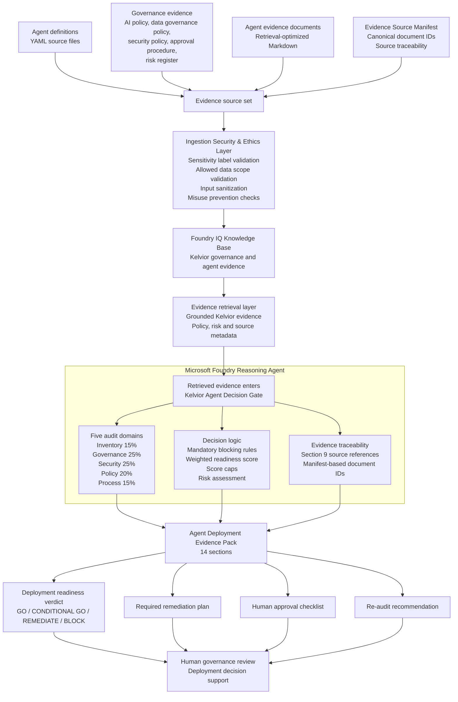

# Architecture Overview — Kelvior Agent Decision Gate

Kelvior Agent Decision Gate is a Microsoft Foundry reasoning agent that evaluates enterprise AI-agent deployment readiness using governed Kelvior evidence grounded through Foundry IQ.

The architecture separates evidence preparation, retrieval grounding, reasoning, traceability, scoring and human governance review.

## Architecture Diagram

The Ingestion Security and Ethics Layer is represented as an MVP architecture layer and lightweight validation concept, not full production enforcement.

## Architecture Flow

1. **Evidence sources**
   The system starts with source-controlled YAML agent definitions, governance evidence, retrieval-optimized Markdown evidence documents and an Evidence Source Manifest.

2. **Ingestion Security and Ethics Layer**
   Before evidence is grounded through Foundry IQ, the MVP models a lightweight validation layer for sensitivity labels, allowed data scopes, input sanitization and misuse-prevention checks.

3. **Foundry IQ Knowledge Base**
   Foundry IQ provides the knowledge grounding layer for Kelvior governance, security, policy, process, risk and agent evidence.

4. **Evidence retrieval layer**
   The retrieval layer provides grounded Kelvior evidence, including policy evidence, risk evidence and source metadata.

5. **Microsoft Foundry Reasoning Agent**
   Kelvior Agent Decision Gate performs the internal reasoning process. It evaluates five audit domains, applies mandatory blocking rules, calculates weighted readiness scores, applies score caps and checks risk conditions.

6. **Agent Deployment Evidence Pack**
   The reasoning agent produces a structured 14-section Evidence Pack containing the deployment verdict, domain findings, evidence references, risk assessment, remediation plan, human approval checklist and re-audit recommendation.

7. **Human governance review**
   The Evidence Pack supports enterprise governance review. The agent does not deploy systems or make final organizational deployment decisions on its own.

## MVP Boundary

The Ingestion Security and Ethics Layer is represented as an MVP architecture layer and lightweight validation concept. Production enforcement would require Microsoft Purview sensitivity labels, Azure RBAC, managed identities, scoped retrieval permissions and policy-driven access control.

## Production Path

A production implementation would strengthen the MVP architecture with:

* Microsoft Purview sensitivity labels
* Azure RBAC
* Managed identities
* Scoped retrieval permissions
* Azure AI Search / Foundry IQ metadata filters
* Policy-as-code validation
* Audit trail and run history
* Human approval workflow integration
