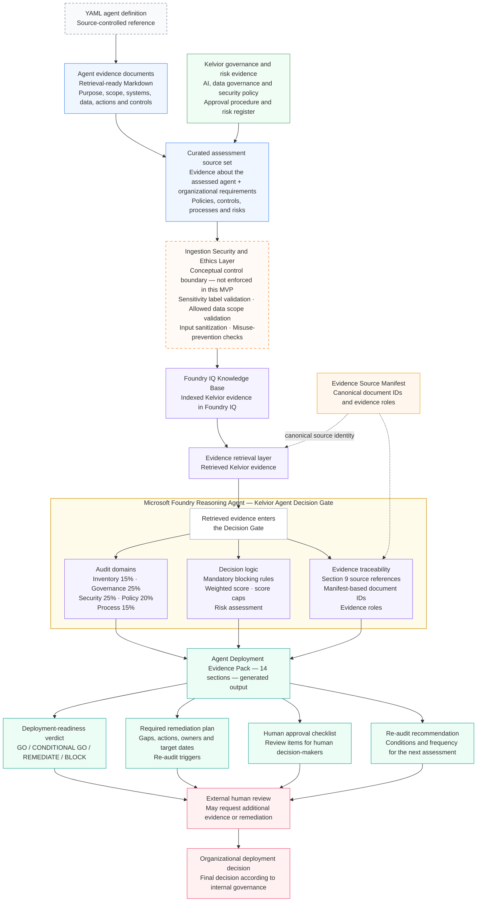

# Architecture Overview — Kelvior Agent Decision Gate

This document explains the architecture behind Kelvior Agent Decision Gate.

The project uses a Microsoft Foundry reasoning agent with evidence retrieved through Foundry IQ to assess whether an AI agent is ready for deployment. The focus is not chat interaction. The focus is the decision path: how source evidence becomes findings, risks, remediation actions and a deployment verdict.

The architecture is built around one principle:

> A deployment verdict should not come from opinion. It should come from evidence, risk and traceable reasoning.

The implementation is an MVP. It demonstrates the architecture pattern for evidence-grounded deployment-readiness assessment, not a production governance platform.

---

## Architecture Diagram



Colors follow the same status legend as [docs/assets/kelvior_architecture.svg](assets/kelvior_architecture.svg): source-controlled reference, retrieval evidence, governance and risk evidence, traceability support, conceptual boundary (not enforced in this MVP), implemented MVP functionality, generated output, and manual/external steps outside the system. Dashed connectors mark traceability-only relationships, not content flow.

---

## Architecture flow

This section explains each architecture layer and what role it plays in the MVP.

### 1. Assessment evidence

The assessment uses two evidence groups that serve different purposes.

**Agent evidence** describes the agent under assessment: its purpose, owner, scope, systems, connectors, data, actions, deployment status and implemented controls.

**Kelvior governance and risk evidence** defines the requirements against which that agent is assessed: AI, data governance and security policy, the agent approval procedure and the enterprise risk register.

The YAML files in `agent_definitions/` are the source-controlled reference definitions for each agent. They are not retrieved by Foundry IQ directly. The Markdown files in `foundry_iq_sources/` are the retrieval-ready representation of that same agent evidence, and are what Foundry IQ actually indexes and retrieves.

Agent evidence and Kelvior governance and risk evidence together form the **curated assessment source set** — the content that moves into ingestion and, eventually, the Foundry IQ Knowledge Base.

The Evidence Source Manifest has a separate role: it maps the retrieval documents to canonical document IDs and evidence roles, so the retrieval layer and the Evidence Pack can reference identifiable sources. It supports traceability at the point evidence is retrieved and used in reasoning; it is not part of the curated source set's content, and it does not add assessment content of its own.

---

### 2. Ingestion Security and Ethics Layer

Before evidence is indexed in the Foundry IQ Knowledge Base, the architecture includes an **Ingestion Security and Ethics Layer**.

In this MVP, this is an architecture concept and validation boundary, not an enforced control. It represents checks that should happen before evidence is trusted by the reasoning agent:

- sensitivity label validation
- allowed data scope validation
- input sanitization
- prompt-injection or instruction-override detection
- misuse-prevention checks

It is included because agent-readiness assessment should not only ask whether the reasoning output looks good. It should also ask whether the evidence entering the system is appropriate, scoped and safe to use. In this MVP, that question is represented in the architecture but not implemented as a running control.

Misuse and scope checks are also applied in the reasoning-agent instruction. Those assessment checks are implemented in the MVP; pre-ingestion enforcement is not.

---

### 3. Foundry IQ Knowledge Base

Foundry IQ provides the indexed knowledge base used by the evidence retrieval layer.

It gives the Microsoft Foundry reasoning agent access to the synthetic Kelvior evidence set during assessment.

The MVP uses retrieval-ready Markdown documents so the agent can retrieve:

- policy requirements
- governance controls
- security expectations
- data governance rules
- approval requirements
- risk register entries
- agent-specific facts
- canonical source references

This keeps the assessment tied to Kelvior evidence instead of relying only on generic model knowledge.

---

### 4. Evidence retrieval layer

The retrieval layer provides the evidence that enters the reasoning process.

For this MVP, retrieval is designed to preserve:

- document identity
- evidence role
- relevant policy sections
- risk IDs
- source references
- agent-specific context

The Evidence Source Manifest supports this by mapping source documents to canonical document IDs and evidence roles.

In production, this should be strengthened with chunk-level metadata, access filters and audit logging in the Azure AI Search / Foundry IQ ingestion pipeline.

---

### 5. Microsoft Foundry reasoning agent

The core implementation is one Microsoft Foundry reasoning agent: **Kelvior Agent Decision Gate**.

The agent performs the readiness assessment across five weighted audit domains — Inventory, Governance, Security, Policy and Process. The weights and what each domain checks are defined in the [agent instructions](../agent_instructions/kelvior_agent_decision_gate_instruction.md) and summarized in the root [README](../README.md#what-the-project-does).

Inside the reasoning agent, the retrieved evidence is used for:

- audit-domain scoring
- mandatory blocking rule evaluation
- weighted readiness scoring
- score caps
- risk assessment
- evidence traceability
- remediation planning
- final verdict selection

This is an MVP design choice. The audit domains and decision logic are implemented inside the reasoning agent. They are not separate production audit services.

---

### 6. Decision logic

The reasoning agent uses four valid verdicts:

- `GO`
- `CONDITIONAL GO`
- `REMEDIATE`
- `BLOCK`

A verdict follows this chain:

```text
evidence → finding → risk → verdict → remediation plan → re-audit
```

Evidence supports a finding. The finding exposes a risk. The combined risks, blocking rules and readiness score determine the verdict. Where controls are missing, the required remediation and the conditions for re-assessment are recorded after the verdict, not before it.

For example:

- If mandatory controls are missing, the agent should not produce `GO`.
- If the agent is acceptable only within a limited or controlled scope, the verdict may be `CONDITIONAL GO`.
- If the agent can remain in assessment or remediation scope but is not ready for rollout, the verdict should be `REMEDIATE`.
- If critical controls are missing for the assessed deployment scope, the verdict should be `BLOCK`.

`REMEDIATE` is a verdict: the agent is not ready, but the gaps are treated as fixable rather than an outright block. Remediation itself is an activity that can follow any verdict — a `CONDITIONAL GO` or even a `BLOCK` can still carry required remediation actions before broader deployment or re-assessment.

---

### 7. Evidence traceability

Traceability is handled through the Evidence Source Manifest and Section 9 of the Evidence Pack.

The purpose is to make source use visible. The agent should not invent document IDs, source titles, risk IDs, policy references, approval states or control evidence.

For the MVP, source identity is supported through retrieval-visible evidence markers and the Evidence Source Manifest.

In production, source identity should be enforced through ingestion metadata, scoped retrieval permissions, audit logs and evidence-version tracking.

---

### 8. Agent Deployment Evidence Pack

The reasoning agent produces a structured **Agent Deployment Evidence Pack** as its main output: 14 sections combining assessment context, audit scores, blocking-rule results, findings, evidence references, risk assessment, verdict, remediation plan and re-audit recommendation. The full section list is documented once, in the root [README](../README.md#evidence-pack-output).

The Evidence Pack is designed for review by governance, security, data, risk and business stakeholders. It is not intended to be a generic chatbot response.

---

### 9. External human review and organizational deployment decision

The final steps sit outside this system, and the architecture keeps them as two distinct stages.

**External human review** is where a reviewer works through the Evidence Pack. They may request additional evidence, ask for remediation, or escalate before any decision gets made. Nothing in this MVP implements a review interface or identity-based sign-off — this is a manual, external step, supported by the Evidence Pack's Human approval checklist rather than executed by it.

**Organizational deployment decision** is the actual go/no-go decision, made according to the organization's own governance process once review is complete.

The Decision Gate does not deploy agents. It does not replace a business owner, a data owner, a security reviewer, a governance board, or legal or compliance review. The reasoning agent produces a deployment-readiness verdict and the evidence behind it; both the review and the final decision remain fully outside the system's scope.

---

## Architecture decisions

### Agent evidence is assessed against organizational requirements

The Decision Gate compares two things: what is documented about the agent under assessment, and what Kelvior's governance, policy, security, process and risk requirements demand. The verdict comes from that comparison, not from a general judgment about whether the agent seems safe.

### Foundry IQ supplies retrieved evidence; it does not reason

Foundry IQ retrieves relevant Kelvior source material for each assessment. The Microsoft Foundry reasoning agent uses that retrieved context to evaluate the agent, instead of relying on general model knowledge. Retrieval and reasoning are separate responsibilities in this architecture, even though both are needed for a grounded verdict.

### One reasoning agent implements the audit logic

The five audit domains and the verdict rules are implemented inside one Microsoft Foundry reasoning agent. They are assessment perspectives within that agent's instruction, not separate audit agents or production services. This keeps the MVP simple to build and test, at the cost of the separation of duties a production system would need between retrieval, scoring and approval components.

### The Evidence Pack supports a human deployment decision

The system produces a structured readiness verdict and the evidence behind it. It does not authorize or execute deployment. An authorized human reviewer, outside the system, remains responsible for the organizational decision.

---

## MVP boundary

This architecture is an MVP.

It demonstrates the reasoning and evidence pattern, not full production enforcement.

The MVP includes:

- Microsoft Foundry reasoning agent
- Foundry IQ knowledge base and retrieval
- synthetic Kelvior evidence sources
- YAML agent definitions
- retrieval-ready Markdown evidence
- Evidence Source Manifest
- audit-domain evaluation
- mandatory blocking logic
- weighted scoring and score caps
- structured Evidence Pack output
- a human approval checklist and re-audit recommendation in the Evidence Pack

The MVP does not implement live identity, access or monitoring enforcement, and it does not connect to live CRM, ERP, HR or ITSM systems or execute live MCP actions. See [Production hardening path](#production-hardening-path) for the specific controls a production version would need.

This MVP was built and tested by one person in a synthetic enterprise environment. Production enforcement could not be validated within this project, because that would require access to real organizational identities, permissions, policies, approval processes, monitoring and security controls.

---

## Production hardening path

A production implementation would require stronger controls around identity, permissions, evidence quality and operational review.

Required hardening would include:

- Microsoft Purview sensitivity labels
- Azure RBAC
- managed identities
- scoped retrieval permissions
- Azure AI Search / Foundry IQ metadata filters
- policy-as-code validation
- approval workflow integration
- audit trail and run history
- stronger ingestion validation
- evidence freshness checks
- monitoring and evaluation pipelines
- change management
- security review

The production pattern would look like this:

```text
governed evidence enters retrieval
→ retrieval is scoped by identity, policy and metadata
→ the reasoning agent evaluates deployment readiness
→ the Evidence Pack exposes the decision path
→ human reviewers approve, reject or require remediation
→ the decision is logged and auditable
```

---

## Synthetic enterprise environment

Kelvior Systems is a fictional enterprise simulation environment.

All business units, departments, systems, employees, customers, vendors, policies, processes, evidence documents and assessment outputs are synthetic.

No real customer, employee, vendor or confidential business data is used.
