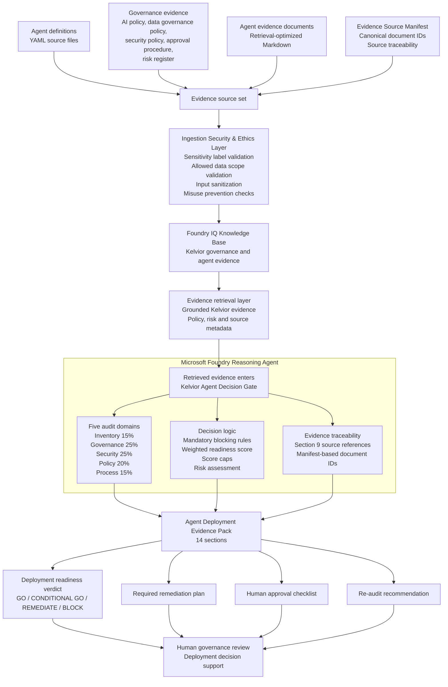

# Architecture Overview — Kelvior Agent Decision Gate

This document explains the architecture behind Kelvior Agent Decision Gate.

The project uses a Microsoft Foundry reasoning agent grounded through Foundry IQ to assess whether an AI agent is ready for deployment. The focus is not on chat interaction. The focus is the decision path: how source evidence becomes findings, risks, remediation actions and a deployment verdict.

The architecture is built around one principle:

> A deployment verdict should not come from opinion. It should come from evidence, risk and traceable reasoning.

The implementation is an MVP. It demonstrates the architecture pattern for evidence-grounded deployment-readiness assessment, not a production governance platform.

---

## Architecture Diagram



---

## Architecture flow

This section explains each architecture layer and what role it plays in the MVP.

### 1. Evidence source set

The architecture starts with a controlled evidence source set.

This includes:

- YAML agent definitions
- Kelvior AI policy evidence
- Kelvior data governance policy evidence
- Kelvior security policy evidence
- agent approval procedure evidence
- enterprise risk register excerpt
- agent-specific evidence documents
- Evidence Source Manifest

The YAML files define the assessed agents in source control.

The Markdown files are retrieval-optimized evidence documents used by Foundry IQ.

This split is intentional. The YAML files preserve source-controlled agent definitions. The Markdown files make the same agent evidence easier for Foundry IQ to retrieve and use during assessment.

---

### 2. Ingestion Security and Ethics Layer

Before evidence reaches the retrieval layer, the architecture includes an **Ingestion Security and Ethics Layer**.

In this MVP, this is an architecture layer and lightweight validation concept.

It represents checks that should happen before evidence is trusted by the reasoning agent, including:

- sensitivity label validation
- allowed data scope validation
- input sanitization
- prompt-injection or instruction-override detection
- misuse-prevention checks

This layer is not full production enforcement.

It is included because agent-readiness assessment should not only ask whether the reasoning output looks good. It should also ask whether the evidence entering the system is appropriate, scoped and safe to use.

---

### 3. Foundry IQ Knowledge Base

Foundry IQ is the grounding layer.

It gives the Microsoft Foundry reasoning agent access to the synthetic Kelvior evidence set during assessment.

The MVP uses retrieval-optimized Markdown documents so the agent can retrieve:

- policy requirements
- governance controls
- security expectations
- data governance rules
- approval requirements
- risk register entries
- agent-specific facts
- canonical source references

This keeps the assessment tied to Kelvior evidence instead of relying only on generic model knowledge.

---

### 4. Evidence retrieval layer

The retrieval layer provides the evidence that enters the reasoning process.

For this MVP, retrieval is designed to preserve:

- document identity
- evidence role
- relevant policy sections
- risk IDs
- source references
- agent-specific context

The Evidence Source Manifest supports this by mapping source documents to canonical document IDs and evidence roles.

In production, this should be strengthened with chunk-level metadata, access filters and audit logging in the Azure AI Search / Foundry IQ ingestion pipeline.

---

### 5. Microsoft Foundry reasoning agent

The core implementation is one Microsoft Foundry reasoning agent: **Kelvior Agent Decision Gate**.

The agent performs the readiness assessment across five audit domains:

| Domain     | Weight | Purpose                                                                                                           |
| ---------- | -----: | ----------------------------------------------------------------------------------------------------------------- |
| Inventory  |    15% | Checks whether the agent identity, owner, scope, systems, connectors, actions and deployment context are defined. |
| Governance |    25% | Checks ownership, approval status, monitoring, audit logging, review cadence and human accountability.            |
| Security   |    25% | Checks access control, least privilege, security review, logging, incident response and controlled actions.       |
| Policy     |    20% | Checks alignment with Kelvior AI policy, data governance policy, security policy and approval procedure evidence. |
| Process    |    15% | Checks process fit, operational boundaries, exception handling, escalation paths and human-in-the-loop controls.  |

Inside the reasoning agent, the retrieved evidence is used for:

- audit-domain scoring
- mandatory blocking rule evaluation
- weighted readiness scoring
- score caps
- risk assessment
- evidence traceability
- remediation planning
- final verdict selection

This is an MVP design choice.

The audit domains and decision logic are implemented inside the reasoning agent. They are not separate production audit services.

---

### 6. Decision logic

The reasoning agent uses four valid verdicts:

- `GO`
- `CONDITIONAL GO`
- `REMEDIATE`
- `BLOCK`

A verdict should follow this chain:

```text
evidence → finding → risk → remediation → verdict
```

The architecture is designed to prevent unsupported decisions.

For example:

- If mandatory controls are missing, the agent should not produce `GO`.
- If the agent is acceptable only within a limited or controlled scope, the verdict may be `CONDITIONAL GO`.
- If the agent can remain in assessment or remediation scope but is not ready for rollout, the verdict should be `REMEDIATE`.
- If critical controls are missing for the assessed deployment scope, the verdict should be `BLOCK`.

The verdict is not only a label.

It is the result of evidence, risk and control maturity.

---

### 7. Evidence traceability

Traceability is handled through the Evidence Source Manifest and Section 9 of the Evidence Pack.

The purpose is to make source use visible.

The agent should not invent:

- document IDs
- source titles
- risk IDs
- policy references
- approval states
- control evidence

For the MVP, source identity is supported through retrieval-visible evidence markers and the Evidence Source Manifest.

In production, source identity should be enforced through ingestion metadata, scoped retrieval permissions, audit logs and evidence-version tracking.

---

### 8. Agent Deployment Evidence Pack

The reasoning agent produces a structured **Agent Deployment Evidence Pack**.

The Evidence Pack has 14 sections:

1. Agent summary
2. Business context
3. Systems and MCP connectors
4. Data classification
5. Audit domain scores
6. Weighted readiness score
7. Mandatory blocking rule evaluation
8. Findings by domain
9. Evidence references
10. Risk assessment
11. Deployment verdict
12. Required remediation plan
13. Human approval checklist
14. Re-audit recommendation

The Evidence Pack is the main architecture output.

It is designed for review by governance, security, data, risk and business stakeholders.

It is not intended to be a generic chatbot response.

---

### 9. Human governance review

The final step is human governance review.

The Decision Gate does not deploy agents.

It does not replace:

- a business owner
- a data owner
- a security reviewer
- a governance board
- legal or compliance review
- production change approval

It supports those roles by producing a structured, evidence-grounded assessment.

The human reviewer remains responsible for the final organizational deployment decision.

---

## MVP boundary

This architecture is an MVP.

It demonstrates the reasoning and evidence pattern, not full production enforcement.

The MVP includes:

- Microsoft Foundry reasoning agent
- Foundry IQ grounding
- synthetic Kelvior evidence sources
- YAML agent definitions
- retrieval-optimized Markdown evidence
- Evidence Source Manifest
- audit-domain evaluation
- mandatory blocking logic
- weighted scoring and score caps
- structured Evidence Pack output
- human review support

The MVP does not implement:

- live production enforcement
- real-time Microsoft Purview policy enforcement
- production-grade Azure RBAC enforcement
- managed identity access enforcement
- production metadata-filtered retrieval permissions
- live MCP action enforcement
- automated approval workflow execution
- enterprise audit trail storage
- live CRM, ERP, HR or ITSM system actions
- continuous control monitoring

That boundary is intentional.

This project shows the decision pattern before claiming production readiness.

---

## Production hardening path

A production implementation would require stronger controls around identity, permissions, evidence quality and operational review.

Required hardening would include:

- Microsoft Purview sensitivity labels
- Azure RBAC
- managed identities
- scoped retrieval permissions
- Azure AI Search / Foundry IQ metadata filters
- policy-as-code validation
- approval workflow integration
- audit trail and run history
- stronger ingestion validation
- evidence freshness checks
- monitoring and evaluation pipelines
- change management
- security review

The production pattern would look like this:

```text
governed evidence enters retrieval
→ retrieval is scoped by identity, policy and metadata
→ the reasoning agent evaluates deployment readiness
→ the Evidence Pack exposes the decision path
→ human reviewers approve, reject or require remediation
→ the decision is logged and auditable
```

---

## Why the architecture is structured this way

The architecture is intentionally simple.

The goal was not to build a full compliance platform. The goal was to test whether a Microsoft Foundry reasoning agent can make AI-agent deployment decisions more explicit, evidence-based and reviewable.

The main architectural separation is between:

- evidence preparation;
- retrieval grounding;
- reasoning;
- traceability;
- scoring;
- risk assessment;
- human review.

That separation keeps the project honest.

The reasoning agent supports the assessment, but it should not hide the evidence, skip risk logic or pretend to be a production approval system.

---

## Synthetic enterprise environment

Kelvior Systems is a fictional enterprise simulation environment.

All business units, departments, systems, employees, customers, vendors, policies, processes, evidence documents and assessment outputs are synthetic.

No real customer, employee, vendor or confidential business data is used.
